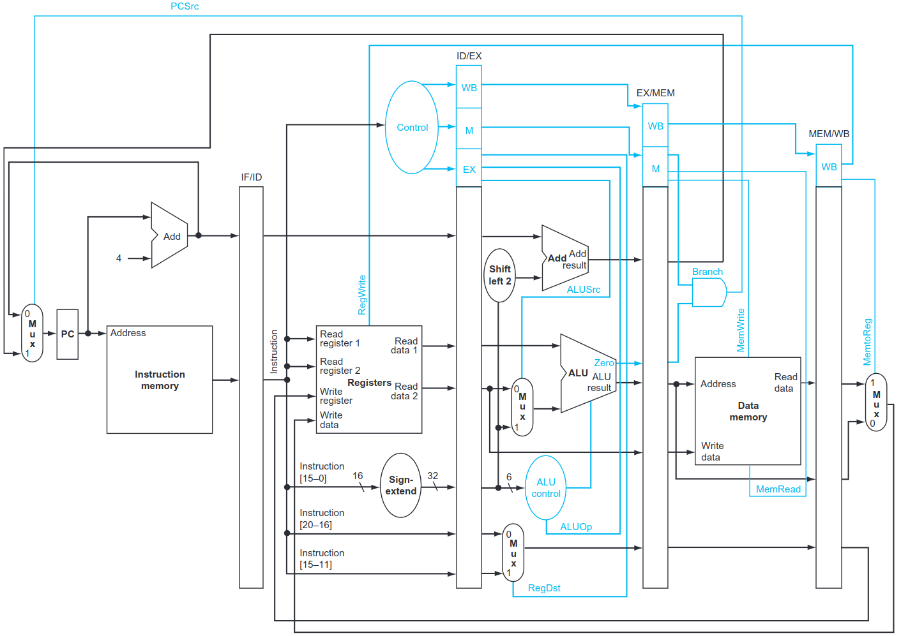
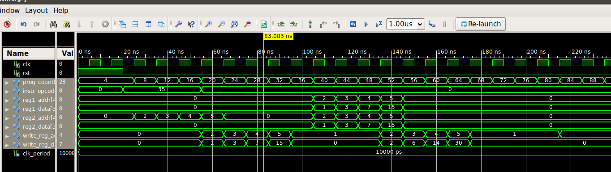

# Lab 06 - Pipelined Datapath

## Introduction
You will need to submit a set of files to test your Pipelined Datapath (similar to you Single Cycle Datapath. The test includes an init.coe, a corresponding .asm (assembly translation of the .coe) and a processor_tb.v file to test the instructions. The individual instruction test from the previous lab should still work (all instructions are independent), but your whole program test won’t work the way it is written.  Write a new .asm and .coe file to test the whole program and at the header of the .asm file write (in comments) what changes needed to be made to get it to work and why?

In the real world, a signal must travel through the entire circuit from it's source to it's destination within one clock cycle. As the circuit's length increases so too does the time it takes for the signal to propagate. The longest path within a design is referred to as the critical path. Knowing the critical path's length allows us to determine the circuit's maximum clock frequency.

In the previous lab, we designed a processor with the PC as the source and destination of all paths. This results in a processor with a longer critical path and a low clock frequency. To improve this we can pipeline the processor, or divide the datapath into stages and at each stage, we register the inputs and outputs. These registers act as new sources and destinations for the circuit's paths. This reduces the length critical path of the circuit allowing for an improved clock frequency.

Pipelining also has the benefit of processing multiple instructions concurrently. However, there are drawbacks. With multiple instructions executing data dependencies between them must be maintained. An instruction could read a register before the previous one has finished writing the new data back. There are a number of techniques to deal with these hazards that will be discussed in class, but for this lab, you can assume pipeline stalls will be inserted by the compiler to ensure correct execution in the processor.

## Deliverables 
For this lab, you are to extend your datapath from the previous Single Cycle Datapath lab to a pipelined version (a fresh template is provided here, but you will likely want to extend your solution from the previous lab). This is done by placing registers between each stage to hold the signals for one cycle. In this way, each set of registers can hold one instruction. A pipelined version of the datapath (shown below) can be found in your textbook.

## Submission:
Each student must turn in one tar file to iLearn. Your work can be (and should be) identical to the other members of your group. The contents of which should be:
    • A README file with the group members names, and any incomplete or incorrect functionality
    • All Verilog file(s) used in this lab (implementation and test benches).
    • All .coe and .asm files used for testing.

If your code does not synthesize or simulate properly, you will receive a 0 on the 

## Outputs 

The expected waveform of the Verilog simulation for the input file  should be as shown below: 

